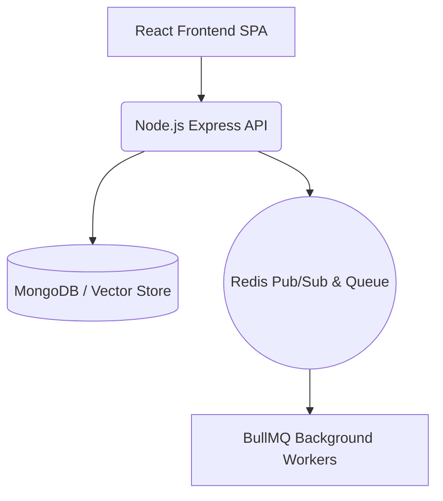

<div align="center">
  
  
  <h1>Voom</h1>
  <p><b>Meet. Collaborate. Remember.</b></p>
  <p>An Enterprise-Grade, Multi-Tenant SaaS Video Conferencing Platform</p>
</div>

---

Voom is a comprehensive, modern SaaS video conferencing platform built on WebRTC, Socket.IO, and the MERN stack. It goes beyond simple video calls by natively integrating AI-driven insights, persistent collaborative workspaces, multi-tenant organizations, and enterprise billing in a highly scalable architecture.

## ✨ Key Features

- **🎥 HD Video Meetings:** Low-latency, peer-to-peer WebRTC video and audio collaboration for teams.
- **🧠 AI Meeting Insights:** Automatically generate executive summaries, action items, and intelligent meeting analytics.
- **📝 Searchable Transcripts:** Every recorded meeting is transcribed and synced to a RAG knowledge search engine ("Ask Voom").
- **🏢 Enterprise Multi-Tenancy:** Strict organization isolation, role-based access control (RBAC), and tenant-based billing (Stripe).
- **💼 Collaborative Workspaces:** Persistent meeting agendas, shared notes, and chat logs embedded directly into the meeting interface.
- **🎨 Premium UI/UX:** A fully modernized, glassmorphism-inspired interface featuring a unified design language (Slate & Orange).

## 🏗️ Architecture

Voom employs a scalable backend architecture optimized for real-time collaboration and compute-heavy background tasks.

### Local & Development Architecture


### Production Architecture (Prepared for Render)
- **Frontend:** Render Static Site (React/Webpack)
- **Backend API:** Render Web Service (Express)
- **Workers:** Render Background Worker (BullMQ)
- **Database:** MongoDB Atlas
- **Cache & Queue:** Managed Redis Provider

**Realtime Routing:** P2P WebRTC signaling is routed through the Socket.IO server, abstracted to support future upgrades to an SFU like LiveKit.

## 🚀 Local Development Setup

### 1. External Dependencies Setup
- **MongoDB**: Install locally or use **MongoDB Atlas**. Obtain your Connection String URI.
- **Redis**: Install locally (v6.2+) or use a managed provider (e.g., Upstash). Obtain your Redis Connection URI.

### 2. Environment Variables
*(Use the provided `.env.example` templates in `ZBACKEND/` and `zfrontend/`)*

**Backend (`ZBACKEND/.env`)**:
```env
PORT=8000
NODE_ENV=development
MONGODB_URI=mongodb://localhost:27017/voom
JWT_ACCESS_SECRET=your-secret
JWT_REFRESH_SECRET=your-refresh-secret
REDIS_URL=redis://localhost:6379
CORS_ORIGIN=http://localhost:3000

# Optional Integration Providers
OPENAI_API_KEY=
ASSEMBLYAI_API_KEY=
STRIPE_WEBHOOK_SECRET=
LOG_LEVEL=info
```

**Frontend (`zfrontend/.env`)**:
```env
REACT_APP_API_URL=http://localhost:8000/api/v1
REACT_APP_SOCKET_URL=http://localhost:8000
```

### 3. Start the Platform
To run the full stack locally, you need three terminal windows:

**API Server:**
```bash
cd ZBACKEND
npm install
npm run dev
```

**Background Worker:**
```bash
cd ZBACKEND
npm run worker
```

**Frontend React App:**
```bash
cd zfrontend
npm install
npm start
```

## 🐳 Docker Deployment (Production-Ready)

Voom is fully Dockerized for reproducible production deployments. The provided `docker-compose.yml` orchestrates the API, Worker, Redis, and Frontend build. *(MongoDB remains externally hosted).*

```bash
export MONGODB_URI="mongodb+srv://..."
export JWT_ACCESS_SECRET="secret"
export JWT_REFRESH_SECRET="refresh"

docker-compose build
docker-compose up -d
```
Access the platform on `http://localhost:3000`.

## 🔄 CI/CD Pipeline

Voom includes a fully automated GitHub Actions pipeline (`.github/workflows/ci.yml`). On every push to `main`:
1. Installs dependencies deterministically (`npm ci`).
2. Generates the Frontend production build.
3. Initializes an ephemeral Redis service container.
4. Executes the full `tests/run_all.mjs` backend regression suite utilizing mocked API providers to prevent billing surprises.

## 🛡️ Security & Observability

- **Security:** JWT Access/Refresh rotation, strict tenant isolation, XSS Sanitization, Helmet Headers, Rate Limiting, and Real-time Socket Authorization.
- **Observability:** Centralized JSON structured logger that automatically masks sensitive keys.
- **Health Probes:** `GET /api/v1/health` and `GET /api/v1/health/ready`.

## 🧪 Testing

Voom features a comprehensive suite of integration and load tests located in the `tests/` directory.

To run the full regression suite manually:
```bash
cd tests
npm ci
node run_all.mjs
```

## 📈 Project Status

- **Phase 1-17:** Core Features, API, WebRTC, AI integration, and CI/CD Completed.
- **Phase 18.5:** Complete Visual Redesign and UI/UX Polish Applied.
- **Final Status:** READY FOR PRODUCTION DEPLOYMENT.
