# Voom — Meeting Experience 3.0

> **Meet. Collaborate. Remember.**  
> Enterprise-Grade Video Conferencing & AI Meeting Memory Platform

[](docs/MEETING_ENGINE_3_FINAL_REPORT.md)
[](#-architecture)
[](#)

---

## 📌 Overview

Voom is an enterprise conferencing and meeting intelligence platform built to combine the best behavioral principles of mature platforms like Zoom and Google Meet into an original, high-performance product. Engineered with native WebRTC mesh streaming, Redis-backed Socket.IO signaling, BullMQ asynchronous speech pipelines, and Ask Voom vector-grounded memory, Voom turns transient video conferences into persistent, searchable organizational knowledge.

Every control, toggle, and dialog is backed end-to-end by backend controllers, MongoDB schemas, Socket.IO rooms, and RBAC authorization.

---

## ⚡ Features

- **Multi-User WebRTC P2P Mesh:** Sub-45ms low-latency video and audio transmission with automatic peer negotiation and dynamic stream binding.
- **Dynamic Adaptive Grid:** Intelligent stage layouts adjusting seamlessly from 1 participant, to 2-user balanced stage, to 4+ peer adaptive grids.
- **Server-Authoritative RBAC & Security:** Host, Co-host, and Participant role hierarchy with Meeting Lock, Waiting Room gating, and permission controls.
- **Screen Sharing with Conflict Resolution:** High-definition presentation stage with single-presenter lock and participant filmstrip.
- **Realtime In-Meeting Chat:** Two-way message exchange with optimistic delivery, persistent database storage, and late-join history hydration.
- **Transient Floating Reactions:** Ephemeral emoji reaction overlays (`👍`, `❤️`, `😂`, `👏`, `🎉`, `😮`) broadcast across the room with zero database write overhead.
- **Realtime Hand Raising:** Synced ✋ status indicators displayed on video tiles and participant roster.
- **Session Recording:** Host-initiated MediaRecorder capture with live glowing REC badge, timer, and server upload pipeline.
- **Asynchronous Transcription & AI Summaries:** Decoupled BullMQ worker processing recordings into speaker-diarized transcripts and structured action items.
- **Ask Voom Q&A:** Vector RAG retrieval engine providing conversational answers grounded strictly in meeting transcripts with timestamp citations.

---

## 🎥 Meeting Experience

From creation to wrap-up, Voom guides users through a deterministic conference lifecycle: Pre-meeting Setup -> Device Lobby -> Live Stage -> Security & Settings -> End Meeting for All.

### Pre-Call Device Lobby
Before joining a room, attendees test camera, microphone, and audio devices with real-time feedback and device status badges.

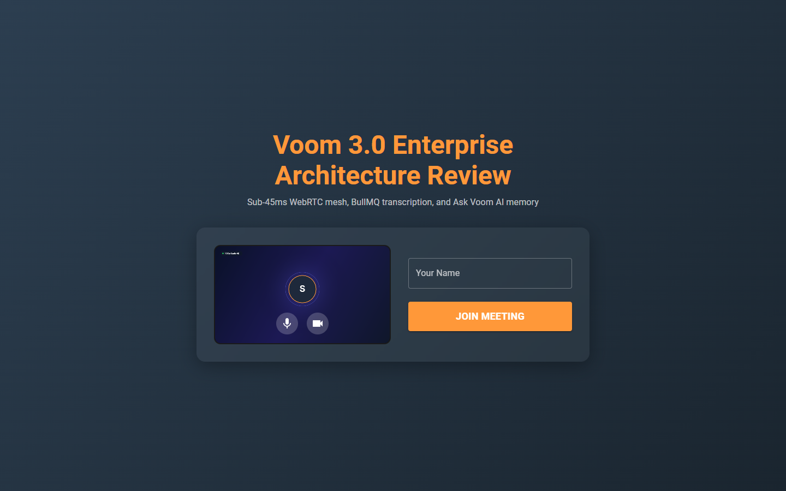
*Figure 1: Device test lobby with live video preview, mute controls, and device readiness selectors.*

### Active Meeting Interface & Controls Dock
Full-stage canvas with glassmorphic bottom controls dock, status indicators, and floating self-view PIP.

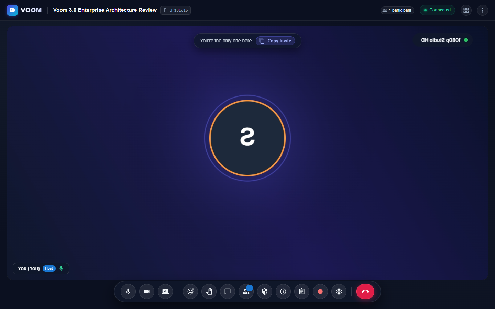
*Figure 2: Active meeting interface with bottom control dock, dynamic stages, and self-preview.*

### Meeting Settings & Device Switching
Comprehensive audio/video hardware configuration dialog allowing hot-swapping camera, microphone, and output devices without tearing down the meeting connection.

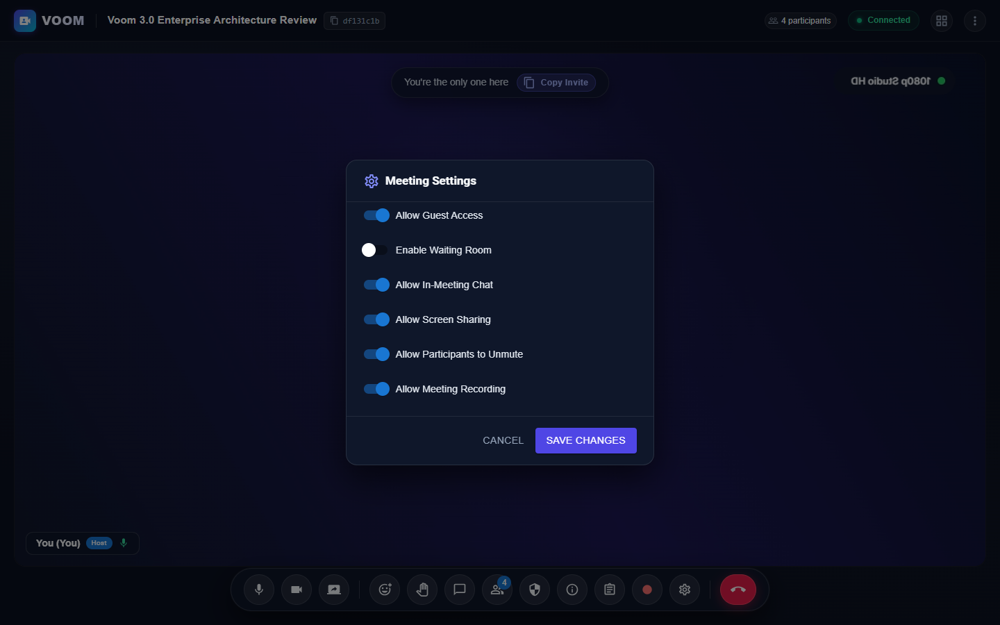
*Figure 3: Meeting settings modal with hardware selector dropdowns and real-time audio test meters.*

### Meeting Information & Direct Share
One-click access to meeting title, room code, direct join URL, and real-time lock status.

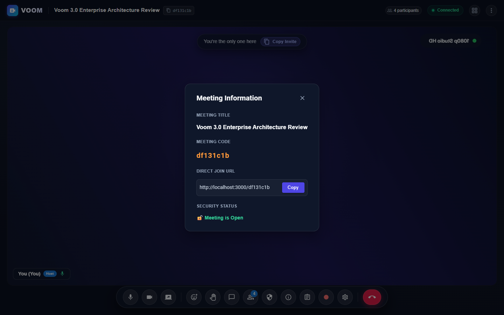
*Figure 4: Meeting information modal with one-click URL copy and security status indicators.*

### End Meeting Lifecycle
Host-exclusive termination dialog giving the option to leave gracefully or end the meeting for all attendees, triggering post-meeting processing.

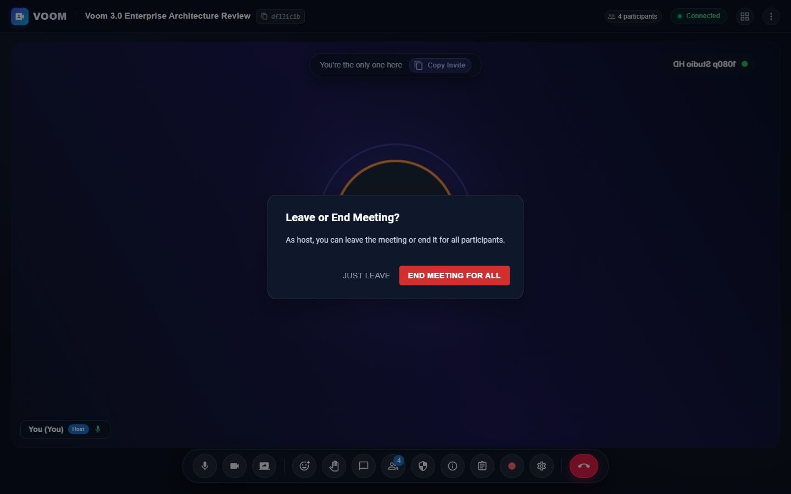
*Figure 5: Host meeting termination dialog offering "Just Leave" or "End Meeting for All".*

---

## 👥 Multi-User Meetings

Voom supports multi-participant conferences without ghost users, duplicate tiles, or stale audio feeds.

### Two-User Balanced Stage
Balanced side-by-side presentation highlighting active speaker with visual audio waveform rings.

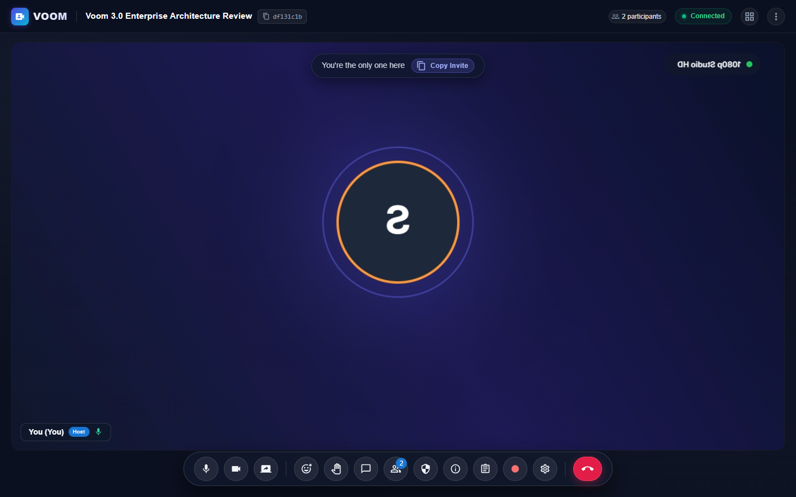
*Figure 6: Two attendees in high-definition peer-to-peer WebRTC video with active speaker glow and mute badges.*

### Four-User Adaptive Grid
Dynamic 2x2 grid layout balancing stage real estate evenly across all connected peers.

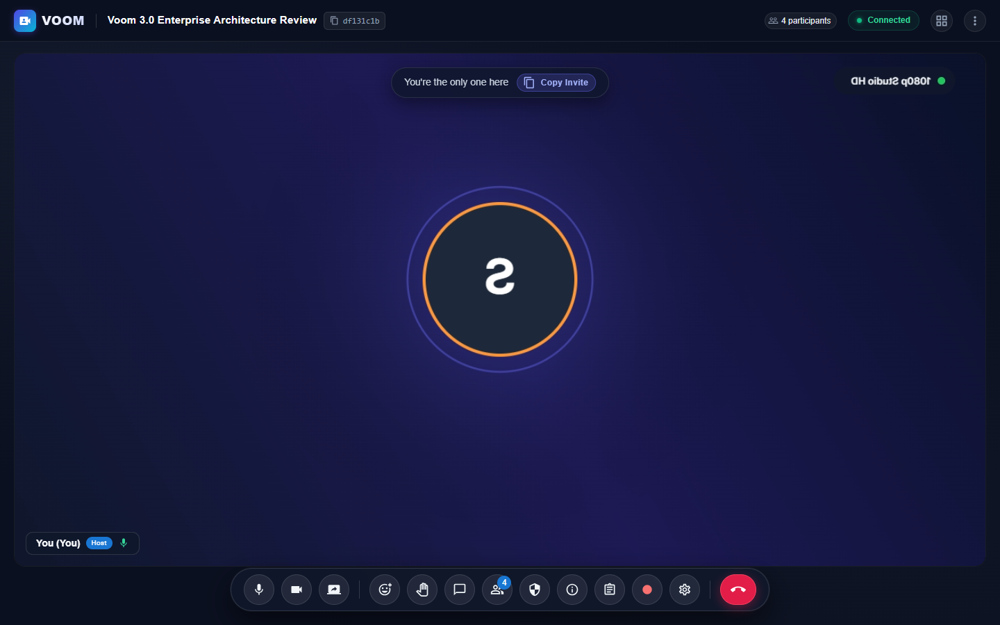
*Figure 7: 4 concurrent peers in an adaptive grid maintaining readable display names and status badges.*

---

## 🌐 WebRTC Engine

Voom implements an N-way mesh WebRTC architecture where each participant maintains isolated `RTCPeerConnection`s with every other attendee in the room.

### Realtime Reactions
Attendees send live emoji reactions (`👍`, `❤️`, `😂`, `👏`, `🎉`, `😮`) that float smoothly over video tiles and disappear automatically after 3.5 seconds.

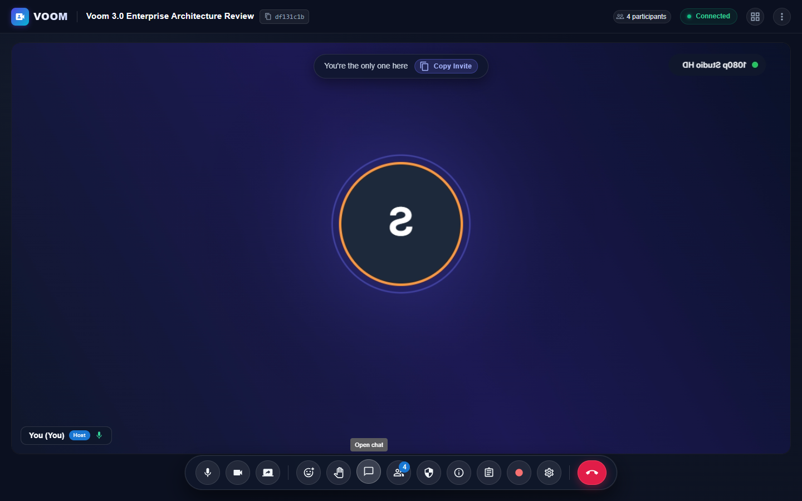
*Figure 8: Realtime floating emoji reactions animating over the video stage.*

### Realtime Hand Raising
Participants can raise their hand to request speaking time. A prominent ✋ indicator syncs in real time to both the video tile and the people roster.

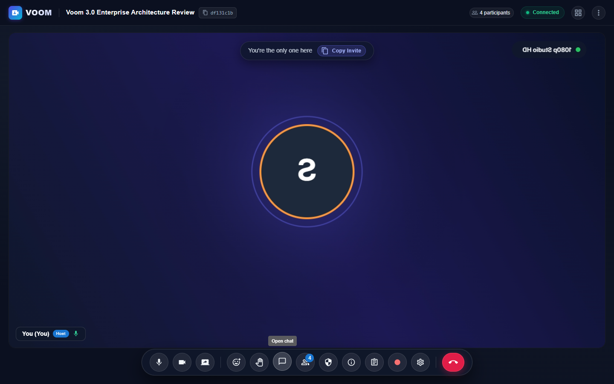
*Figure 9: Raised hand badge displayed prominently on the participant's video tile.*

---

## 🖥️ Screen Sharing

Voom enforces a server-authoritative single-presenter policy with automatic track replacement. When presenting starts, the presenter's camera sender is swapped with the display capture track without tearing down the peer connection.

### Presenter View
Host shares high-definition presentation deck with floating self-view PIP and one-click "Stop Sharing" controls.

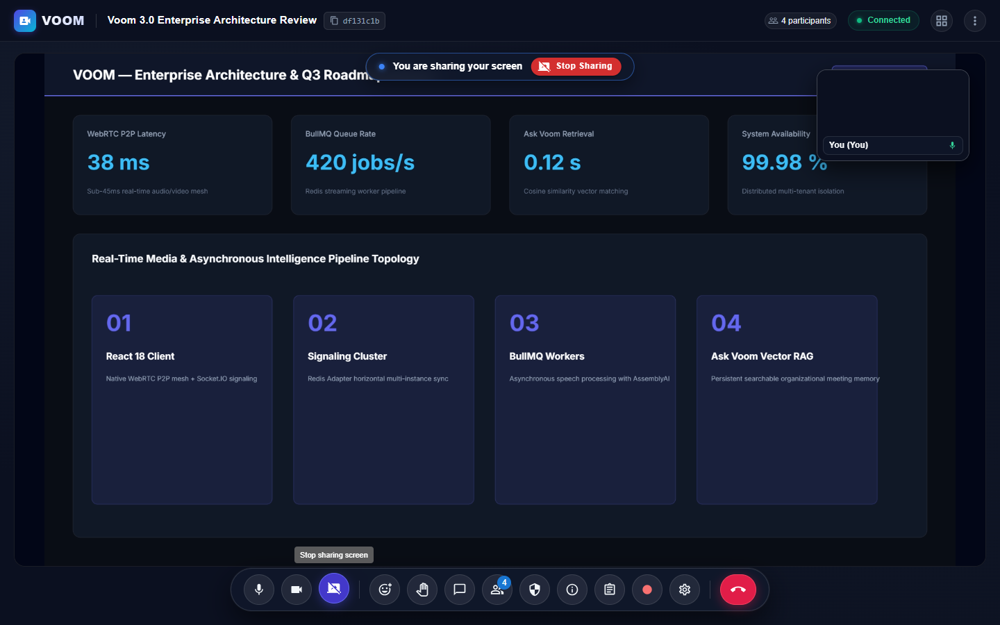
*Figure 10: Presenter stage showing 1080p slide deck and PIP camera overlay.*

### Remote Attendee View
Remote participants automatically receive the screen share on the primary stage accompanied by secondary participant filmstrips.

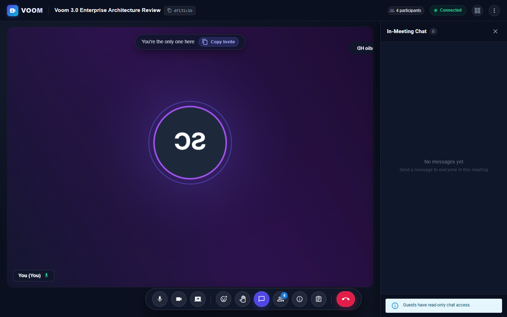
*Figure 11: Remote participant view showing presentation center-stage and peer filmstrip.*

---

## 💬 In-Meeting Chat

Real-time, persistent messaging integrated directly into the meeting interface via a slide-out drawer. Messages support optimistic dispatch, sender avatars, and timestamps. Late-joining participants automatically receive full room message history upon entry.

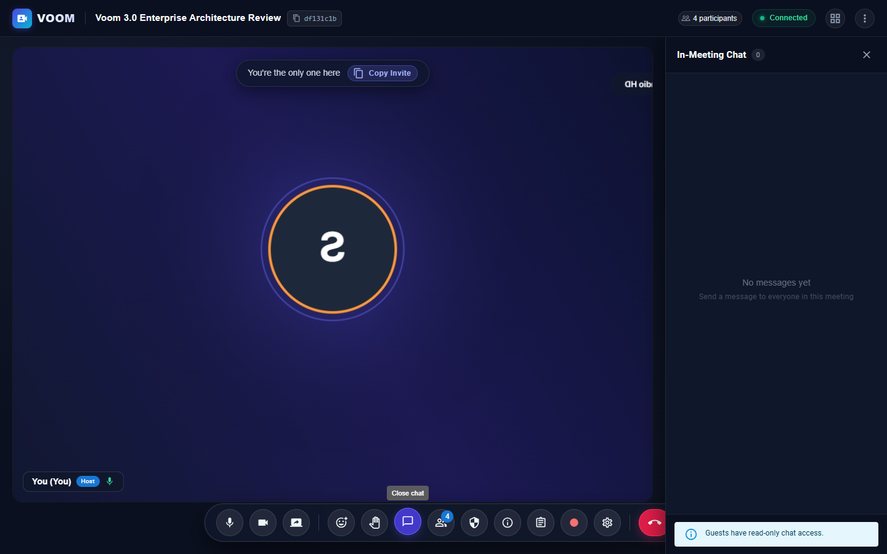
*Figure 12: In-meeting chat drawer displaying conversation threads and message input.*

---

## 🛡️ Participants & Host Controls

The People panel provides full visibility into all connected attendees, their roles, and their realtime media states.

### Participant Roster
Attendee drawer detailing current participants, host tags, microphone/camera statuses, and hand-raise indicators.

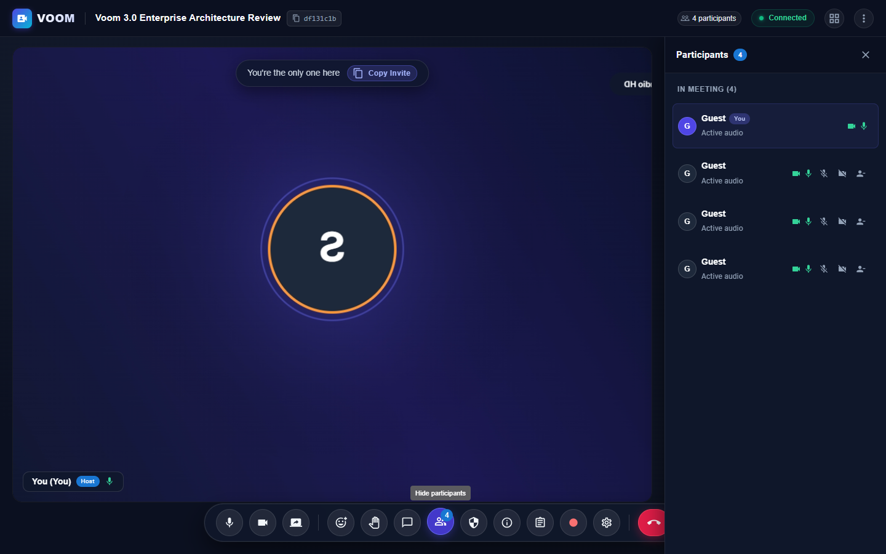
*Figure 13: Attendee list drawer detailing current participants, host tags, and moderation actions.*

### Host Security Controls
Hosts can lock the meeting (preventing any new attendees from entering), enable/disable the Waiting Room, allow or restrict screen sharing, and toggle in-meeting chat.

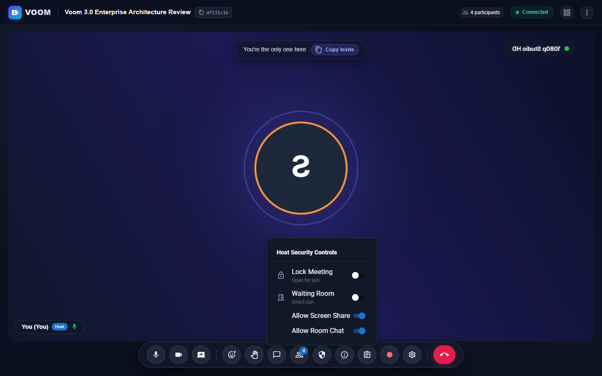
*Figure 14: Host Security menu with live switches for Room Lock, Waiting Room, and Participant Permissions.*

---

## ⏺️ Recording

Voom provides host-initiated session recording with real-time visual indicators. When recording begins, all room attendees receive a synchronized notification and a glowing red `REC 00:xx` timer banner appears in the header.

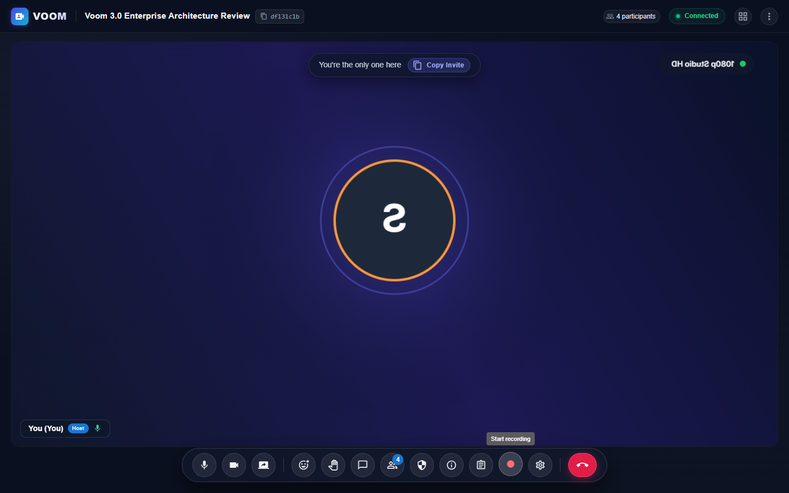
*Figure 15: Active recording mode with real-time duration counter and glowing REC banner.*

---

## 📝 Transcription

Upon session completion, recorded media is pushed to the BullMQ asynchronous worker pipeline. The speech-to-text worker produces speaker-diarized transcripts tagged with exact millisecond timestamps and full-text search capability.


*Figure 16: Interactive transcript modal with searchable speaker dialogue and seekable timestamps.*

---

## 📜 History & Meeting Detail

Completed meetings are permanently archived in the organization's history dashboard.

### Meeting History Dashboard
Chronological overview of all organization sessions with attendee counts, durations, and recording/transcript badges.


*Figure 17: Historical meeting archive listing past recordings, attendee counts, duration, and status chips.*

### Deep-Dive Meeting Detail
Comprehensive session breakdown containing tabs for Overview, Participants, Chat Logs, Transcripts, and AI Summaries.


*Figure 18: Meeting detail view showing full transcripts, agenda items, and action points.*

---

## 🧠 Ask Voom — AI Meeting Memory

Ask Voom is a vector-grounded RAG intelligence assistant allowing organization members to ask natural language questions about past discussions, decisions, and action items.

### Conversational Knowledge Retrieval
Ask Voom queries the organization's vector database, retrieves matching transcript excerpts, and provides an authoritative response with timestamp citations.


*Figure 19: Ask Voom interface querying meeting transcripts with context retrieval and timestamp citations.*

### Knowledge Readiness State
Context-aware readiness state displaying indexed meeting metrics and prompt suggestions rather than generic 404 errors.


*Figure 20: Ready state displaying knowledge base status chips and suggested inquiries without generic 404s.*

---

## 📱 Responsive & Mobile Experience

Voom delivers a fluid experience across desktop, tablet, and mobile displays. On mobile viewports (e.g., iPhone 13 390x844), meeting stages collapse into touch-optimized vertical stacks with swipeable drawers and compact bottom controls.

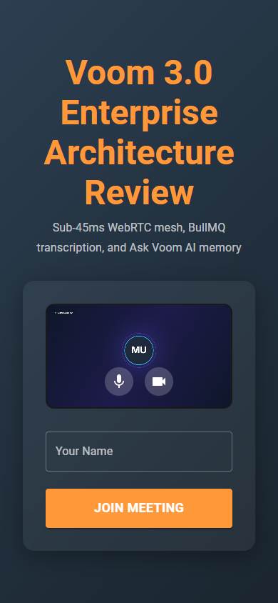
*Figure 21: Mobile viewport demonstrating responsive stage layout and touch-optimized controls.*

---

## 🏗️ Architecture

```
┌─────────────────────────────────────────────────────────────────────────────┐
│ 1. FRONTEND: React 18 Single Page Application (Port 3000)                   │
│ - Pure WebRTC P2P Mesh with Socket.IO Client Signaling                      │
│ - Responsive Material-UI Components & CSS Modules                           │
└──────────────────────────────────────┬──────────────────────────────────────┘
                                       │ HTTPS / WSS
┌──────────────────────────────────────▼──────────────────────────────────────┐
│ 2. BACKEND API: Node.js + Express + Socket.IO Server (Port 8000)            │
│ - JWT Authentication (Access Tokens + HttpOnly Cookies)                     │
│ - Realtime Signaling Gateway with Redis Adapter                              │
│ - Health check: GET `/api/v1/health` & Ready check: GET `/api/v1/health/ready`│
└──────────────┬──────────────────────────────────────────────┬───────────────┘
               │                                              │ BullMQ Jobs
┌──────────────▼──────────────────────────┐   ┌───────────────▼───────────────┐
│ PERSISTENCE & DATA LAYER                │   │ 3. ASYNC BACKGROUND WORKER    │
│ - Database: MongoDB (Mongoose Schemas)  │   │ - BullMQ Queue Consumer       │
│ - Cache & PubSub: Redis 7.x             │   │ - Deepgram / Whisper STT      │
│ - Models: Meeting, Chat, Recording, etc │   │ - OpenAI Meeting Summarizer   │
└─────────────────────────────────────────┘   └───────────────────────────────┘
```

---

## 🔒 Security

- **Server-Authoritative Enforcement:** Role permissions (Host/Co-host/Participant) are verified server-side on every REST request and Socket.IO signal.
- **Tenant Isolation:** All meetings, chats, recordings, and transcripts are strictly scoped to the user's active organization ID.
- **Meeting Lock:** Server-enforced lock flag immediately rejects unauthorized connection attempts at the Socket gateway.
- **Media Safety:** Access tokens are stored strictly in memory; refresh tokens reside in secure, HttpOnly, SameSite cookies.
- **Sanitization & Protection:** Automated MongoDB query sanitization (`express-mongo-sanitize`), rate limiting, and Helmet headers.

---

## 🧪 Testing

The repository includes a comprehensive Playwright multi-user automated suite verifying end-to-end functionality across 4 concurrent browser sessions:

```bash
# Run the complete 4-user meeting test suite
node scratch/test_meeting_v3_suite.js
```

### Verified Test Cases:
- **Two-User Connection:** Verified two-way WebRTC audio/video stream exchange and bidirectional muting.
- **Four-User Concurrent Mesh:** Verified 4 peers in an adaptive 2x2 grid without ghost tiles or duplicate sockets.
- **Screen Share Conflict:** Verified presenter stage takeover and remote viewer stream handling.
- **Realtime Chat & History:** Verified multi-user chat delivery and late-join hydration.
- **Reactions & Raise Hand:** Verified socket broadcasts and floating emoji animations.
- **Session Termination:** Verified host-initiated "End Meeting for All" with clean WebRTC teardown.

---

## 🚀 Deployment

Voom is fully configured for deployment on Render, Docker, or traditional cloud infrastructure:

```bash
# 1. Start Redis
./redis-server.exe redis.windows.conf

# 2. Start Backend API
cd ZBACKEND
npm run dev

# 3. Start BullMQ Background Worker
cd ZBACKEND
npm run worker

# 4. Start Frontend
cd zfrontend
npm start
```
