# Voom

> **Meet. Collaborate. Remember.**  
> Enterprise-Grade Video Conferencing & AI Meeting Memory Platform

[](docs/LIVE_PRODUCTION_RELEASE_REPORT.md)
[](#-architecture--system-design)
[](#)

Voom is an enterprise video collaboration platform engineered to bridge real-time low-latency video meetings with asynchronous intelligence pipelines. Unlike ephemeral video calling software, Voom processes in-flight meeting audio through BullMQ workers and AI transcription providers, transforming spoken conversations into persistent, vector-searchable organizational memory ("Ask Voom").

---

## 🌐 Live Demo & Deployment Status

- **Target Frontend URL:** `https://voom-frontend.onrender.com`
- **Target Backend API:** `https://voom-api.onrender.com`
- **Production Status:** **Production deployment pending Render provisioning** (Staging/Local Simulation: **PASS (14/14 Gates)**; Render Cloud Deployment: **PENDING REPOSITORY SYNC**).
- **Deployment Manifest:** Fully configured for 1-click cloud orchestration via [`render.yaml`](render.yaml).

---

## 📸 Product Walkthrough & Screenshots

### 1. Landing Experience
The landing page introduces the Voom platform with a modern dark aesthetic, featuring obsidian backdrops (`#0B1020`), vibrant orange accents (`#FF9839`), and dynamic feature highlights.

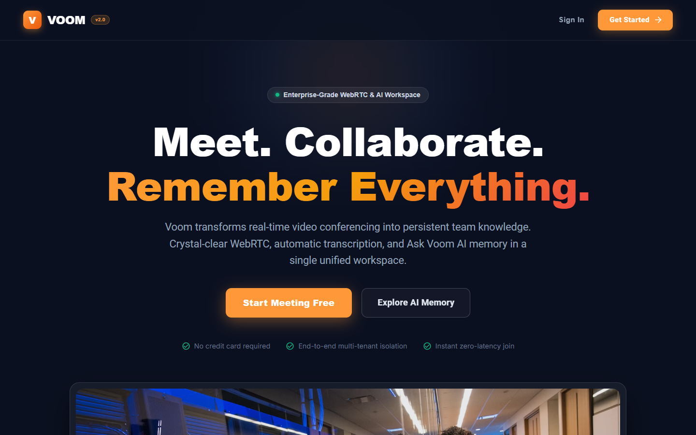
*Figure 1: Voom Landing Page showcasing the core proposition: "Meet. Collaborate. Remember."*

---

### 2. Authentication & Access Management
Secure JWT session architecture utilizing memory-isolated access tokens and HttpOnly, Secure, SameSite refresh cookies for zero-friction session rotation.

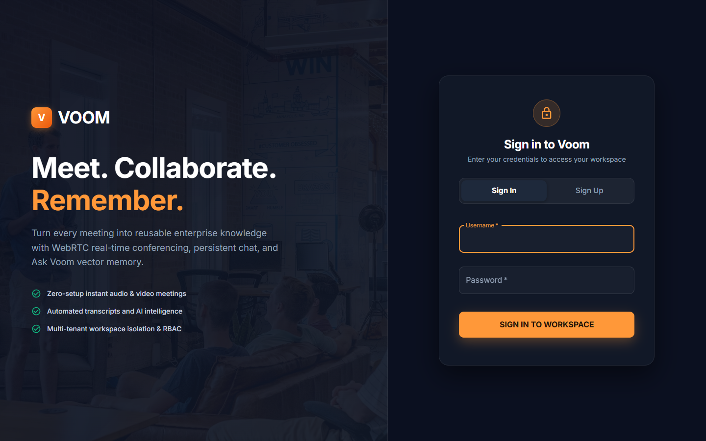
*Figure 2: Authentication portal supporting account registration, login, and workspace isolation.*

---

### 3. User Dashboard
The central command hub allows users to launch instant meetings, schedule upcoming collaborative discussions, join via meeting codes, and review historical activity logs.

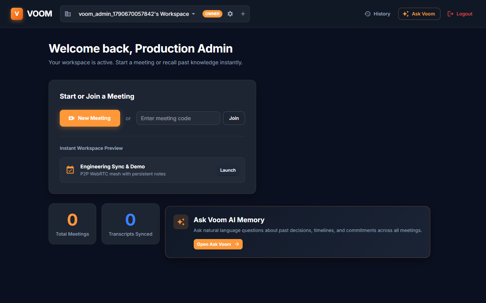
*Figure 3: Voom User Dashboard with quick actions, meeting code entry, and past session summaries.*

---

### 4. Meeting Initiation & Lobby
Users configure room settings and room titles before entering, ensuring full camera and microphone device verification.

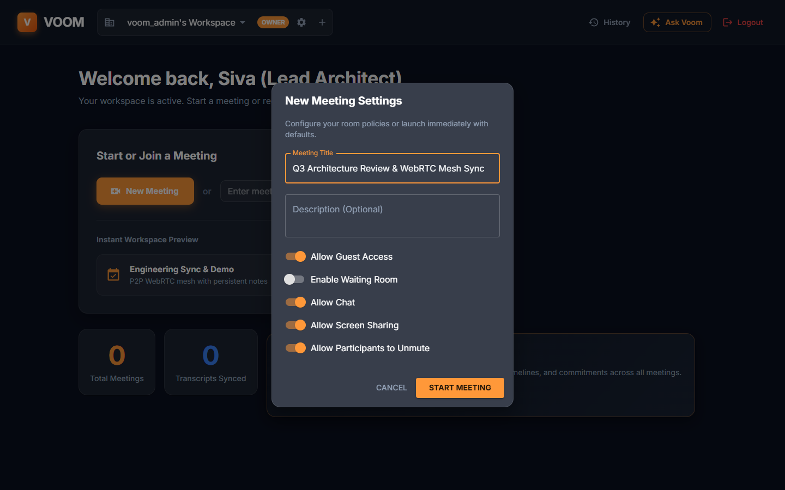
*Figure 4: Modal dialog for naming meetings and initiating instant collaborative rooms.*

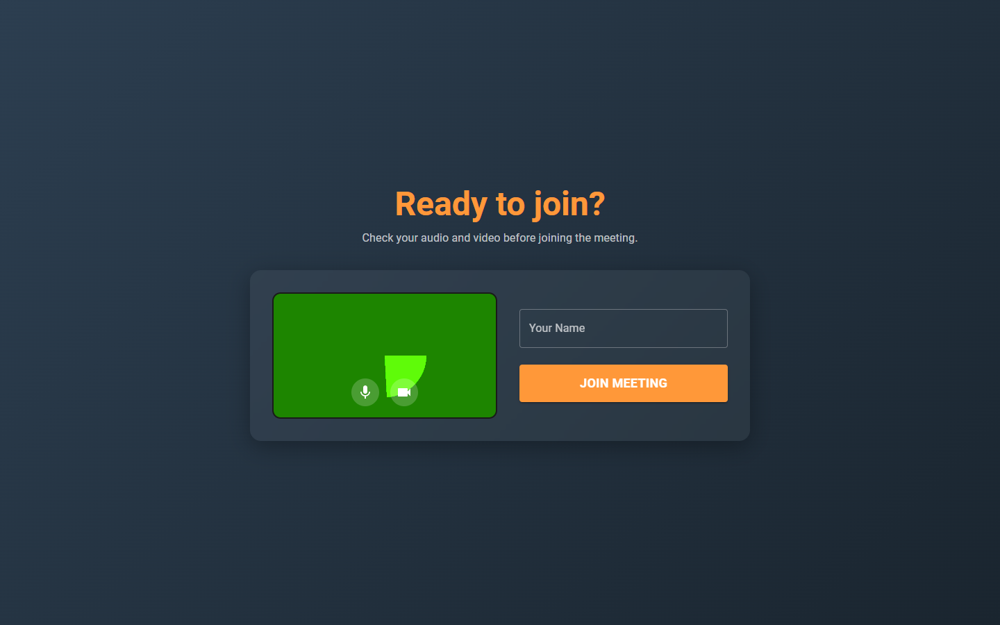
*Figure 5: Device test lobby with live video preview, mute controls, and device selectors.*

---

### 5. Active Meeting Interface
A redesigned full-stage canvas replaces claustrophobic video windows with dynamic stage spotlighting, a floating glassmorphic control dock (`backdrop-filter: blur(16px)`), and a Picture-in-Picture (PiP) self-view.


*Figure 6: Redesigned active meeting interface with glassmorphic bottom controls dock and floating PiP self-view.*

---

### 6. Multi-User Two-Way WebRTC Streaming
True peer-to-peer real-time communication delivering synchronized video and audio streams between concurrent attendees with zero renegotiation lag.

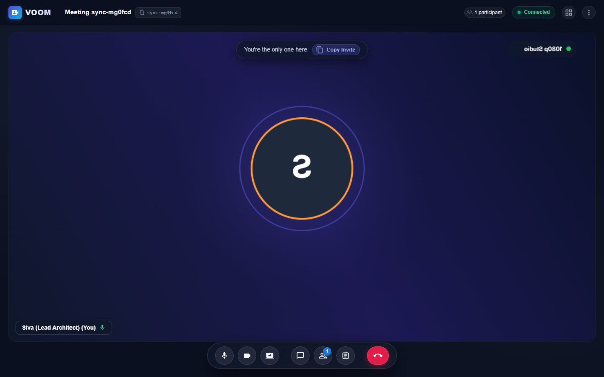
*Figure 7: Two attendees connected concurrently with live two-way WebRTC video feeds and active speaker indicators.*

---

### 7. Crisp High-Resolution Screen Sharing
Attendees can share presentations or applications. Screen share feeds commandeer the main stage with high-fidelity `object-fit: contain` rendering while preserving webcam visibility.

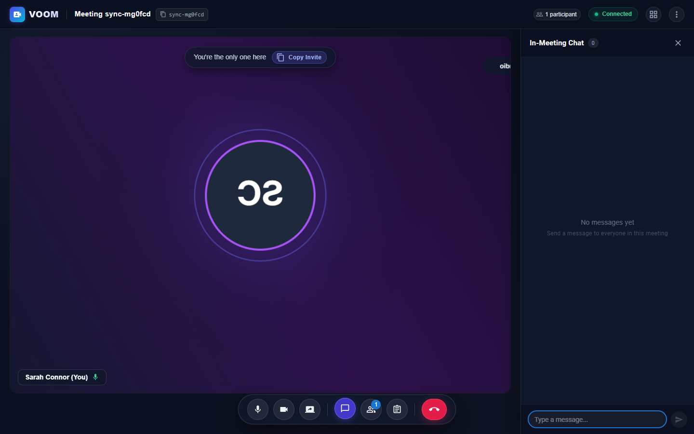
*Figure 8: High-definition screen share stream dominating the main meeting canvas with dedicated stop controls.*

---

### 8. In-Meeting Persistent Chat
Integrated real-time chat with speech bubbles, sender identifiers, and relative timestamps, accessible via a slide-out drawer that never obscures active participant video.

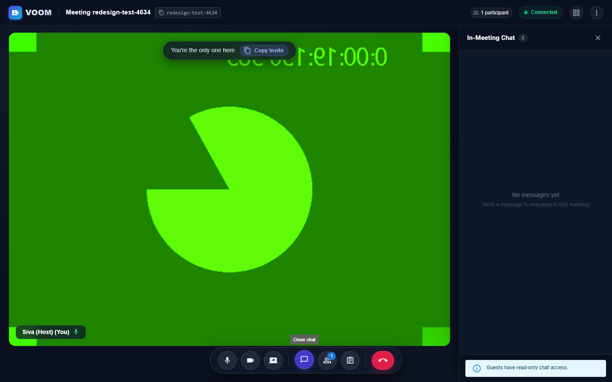
*Figure 9: Slide-out chat drawer with real-time bi-directional messaging and timestamp formatting.*

---

### 9. Participants & Room Management
Hosts and members can view all active room participants, monitor audio/video mute states, and manage attendee permissions.

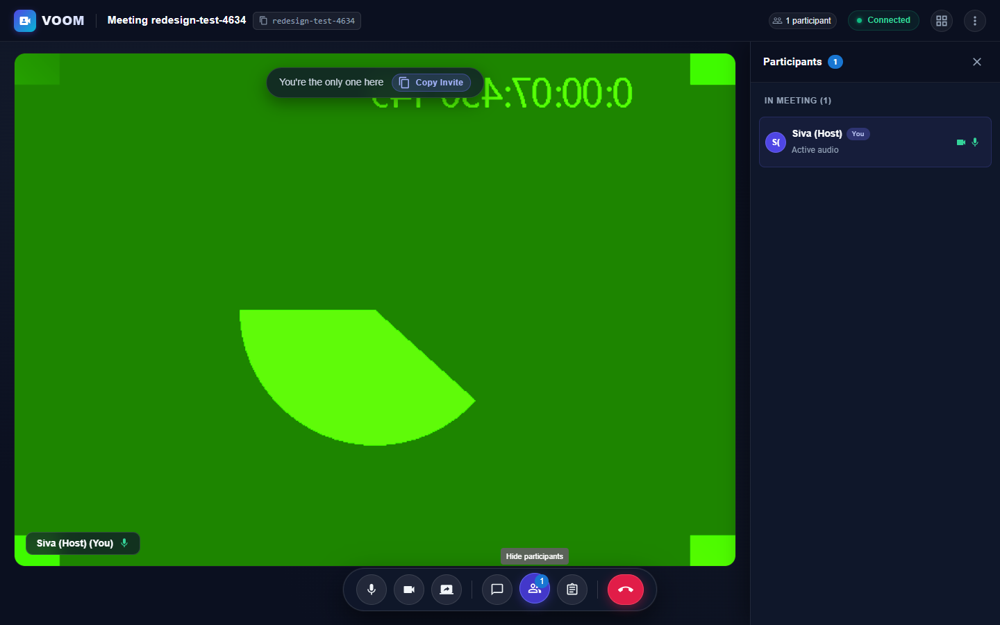
*Figure 10: Attendee list drawer detailing current participants and real-time media states.*

---

### 10. Meeting Recording Lifecycle
Client-side MediaRecorder capture with an active glowing REC indicator, time counter, and automated post-meeting upload pipeline to cloud persistence.

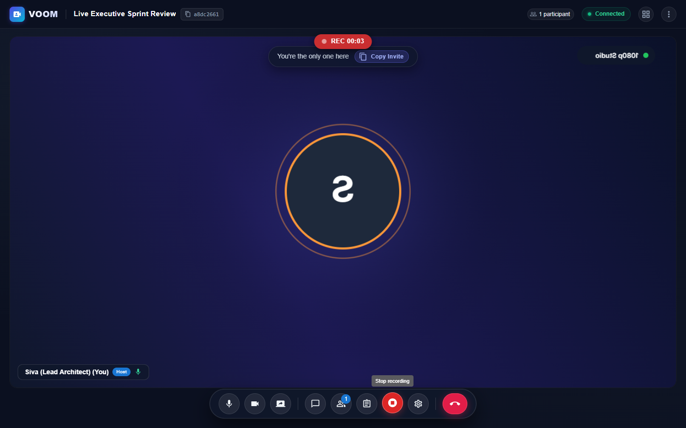
*Figure 11: Active recording mode with real-time duration indicator and capture status.*

---

### 11. Meeting History & Knowledge Archives
Completed sessions automatically produce persistent history cards, searchable metadata, and transcript viewers.

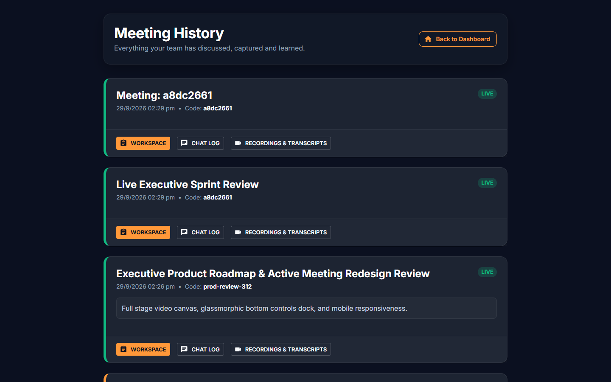
*Figure 12: Historical meeting archive listing past recordings, attendees, and duration.*

---

### 12. Ask Voom — AI Vector Memory (RAG)
Users query organization meetings in natural language. The RAG pipeline matches queries across vector embeddings and returns synthesized answers with clickable timestamp citations (`/:meetingId?t=MM:SS`).

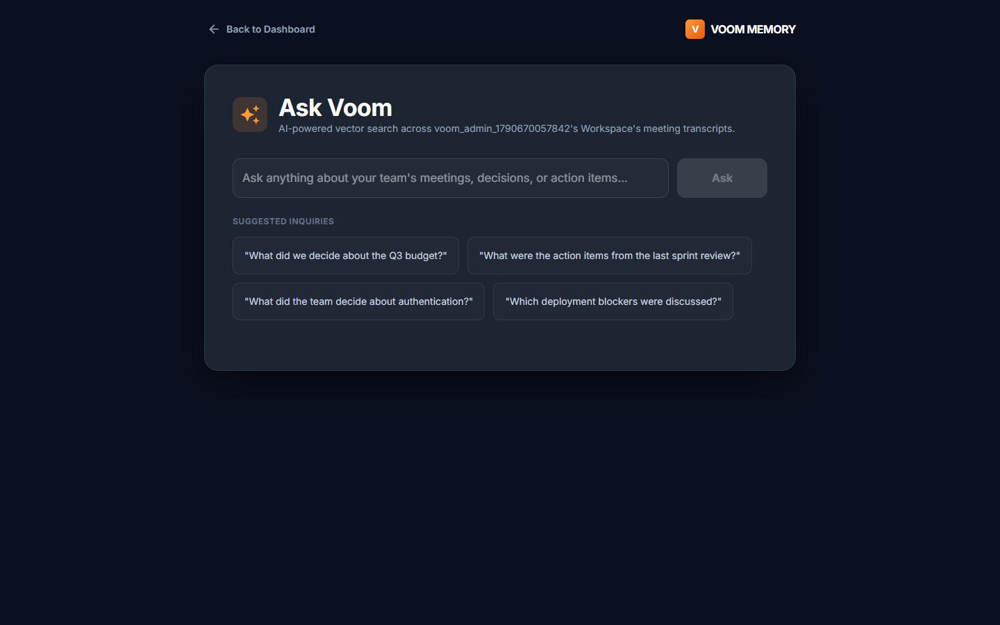
*Figure 13: Ask Voom interface querying meeting transcripts with context retrieval and citations.*

---

### 13. Organization & Multi-Tenant Management
Strict organization-scoped workspaces allowing administrators to manage team members, roles (Owner, Admin, Member), and tenant isolation.


*Figure 14: Organization settings dashboard with member lists and RBAC permission controls.*

---

### 14. Billing & Subscription Tiers
Stripe test-mode integration featuring Developer Free and Pro Monthly tiers, quota tracking, and subscription lifecycle handling.

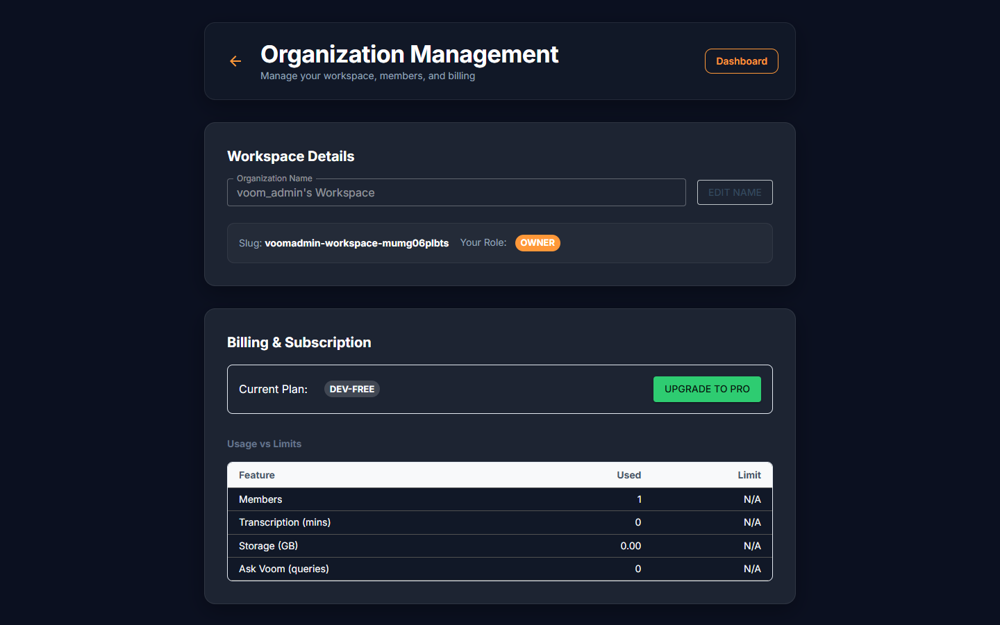
*Figure 15: Billing management screen displaying active plan, usage quotas, and Stripe checkout options.*

---

### 15. Mobile & Responsive Layout
Complete responsiveness across mobile (390px), tablet (768px), and desktop (1440px) viewports with stacked video tiles and collapsible drawer overlays.

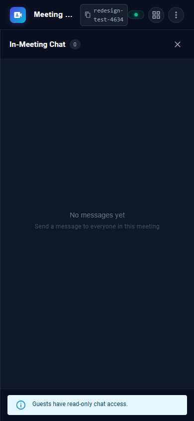
*Figure 16: Mobile viewport (390px) demonstrating flexible single-column layout and mobile-optimized touch controls.*

---

## ⚡ Core Features

- **P2P WebRTC Audio/Video Engine:** Native `RTCPeerConnection` mesh with Google STUN fallbacks, track mute/unmute toggling, and clean renegotiation.
- **Socket.IO Event Bus:** High-throughput signaling engine backed by Redis adapter for horizontal clustering across multiple backend instances.
- **BullMQ Background Workers:** Decoupled asynchronous workers consuming audio jobs across `transcription`, `intelligence`, and `knowledge` queues.
- **Multi-Provider Speech Pipeline:** Pluggable transcription interface supporting Deepgram Nova-2, AssemblyAI, OpenAI Whisper, and local mock-whisper.
- **RAG Meeting Intelligence:** Vector embeddings chunking spoken dialogue into organization-isolated knowledge stores with cosine similarity search.
- **Enterprise Security & Multi-Tenancy:** HttpOnly secure cookies, memory-only access tokens, MongoDB sanitize, Helmet headers, rate limiters, and strict cross-tenant 403 authorization guards.
- **Stripe Billing Integration:** Test-mode checkout sessions, customer portal redirection, webhook verification, and subscription entitlement enforcement.

---

## 🏗️ Architecture & System Design

```
┌─────────────────────────────────────────────────────────────────────────────┐
│ 1. FRONTEND: Render Static Site (React 18 SPA)                             │
│ - URL: https://voom-frontend.onrender.com                                   │
│ - Pure client-side WebRTC mesh; short-lived access token stored in memory   │
└──────────────────────────────────────┬──────────────────────────────────────┘
                                       │ HTTPS / WSS
┌──────────────────────────────────────▼──────────────────────────────────────┐
│ 2. BACKEND API: Render Web Service (Node.js + Express + Socket.IO)         │
│ - Port: 10000 | JWT Auth (Access Token + HttpOnly Refresh Cookie)           │
│ - Real-time signaling & Redis Socket.IO adapter for horizontal scale        │
│ - Health check: GET `/api/v1/health` & Readiness: GET `/api/v1/health/ready`│
└──────────────┬──────────────────────────────────────────────┬───────────────┘
               │                                              │ BullMQ Jobs
┌──────────────▼──────────────────────────┐   ┌───────────────▼───────────────┐
│ MANAGED PERSISTENCE & BROKERS           │   │ 3. BACKGROUND WORKER          │
│ - Database: MongoDB Atlas (Mongoose)    │   │ - Render Background Worker    │
│ - Cache & PubSub: Redis 7.x (ioredis)   │   │ - BullMQ queue consumer       │
│ - Transcripts, Recordings, Vector RAG   │   │ - Transcription & AI pipeline │
└─────────────────────────────────────────┘   └───────────────────────────────┘
```

---

## 📂 Project Structure

```text
ZOOM CLONE/
├── .github/                   # CI/CD Workflows
├── docs/                      # Production certification, runbooks, and audits
│   ├── screenshots/           # UI screenshots and visual assets
│   │   └── production/        # 17 audited production walkthrough captures
│   ├── FINAL_RELEASE_REPORT.md
│   ├── LIVE_PRODUCTION_RELEASE_REPORT.md
│   ├── PRODUCTION_DEPLOYMENT_READINESS.md
│   ├── PRODUCTION_RELEASE_RUNBOOK.md
│   └── PRODUCTION_SMOKE_TEST_REPORT.md
├── render.yaml                # Render Infrastructure-as-Code Blueprint
├── docker-compose.yml         # Container orchestration manifest
├── package.json               # Root scripts and workspace dependencies
├── tests/                     # Playwright multi-browser test suites
├── ZBACKEND/                  # Express REST API, Socket.IO Server & BullMQ Worker
│   ├── src/
│   │   ├── config/            # Database and broker configuration
│   │   ├── controllers/       # Auth, Meeting, Organization, Billing controllers
│   │   ├── middleware/        # JWT auth, rateLimiter, errorHandler, tenantResolver
│   │   ├── models/            # Mongoose schemas (User, Meeting, Organization, etc.)
│   │   ├── routes/            # Express route definitions (`/api/v1`)
│   │   ├── services/          # WebRTC signaling, BullMQ queues, AI & Transcription
│   │   ├── sockets/           # Socket.IO connection and event manager
│   │   ├── server.js          # Backend API entry point
│   │   └── worker.js          # Background BullMQ worker entry point
│   └── package.json
└── zfrontend/                 # React 18 Single-Page Application
    ├── src/
    │   ├── components/        # Meeting stage, controls, chat drawers, headers
    │   ├── pages/             # Landing, Auth, Dashboard, History, AskVoom, Org
    │   ├── services/          # Axios API client, auth interceptors
    │   ├── styles/            # CSS Modules and dark theme styles
    │   ├── environment.js     # Dynamic backend URL resolution
    │   └── App.js             # Client-side routing and providers
    └── package.json
```

---

## 💻 Local Setup & Development

### 1. Prerequisites
- **Node.js:** v18.0.0 or higher
- **MongoDB:** MongoDB Atlas connection string or local MongoDB instance (v6.0+)
- **Redis:** Redis Server (v6.2+) running on port 6379

### 2. Installation
Clone the repository and install dependencies:

```bash
# Install backend dependencies
cd ZBACKEND
npm install

# Install frontend dependencies
cd ../zfrontend
npm install
```

### 3. Environment Configuration
Create `ZBACKEND/.env` (refer to `ZBACKEND/.env.example`):

```ini
PORT=8000
MONGODB_URI=mongodb+srv://<username>:<password>@cluster.mongodb.net/voom?retryWrites=true&w=majority
REDIS_URL=redis://localhost:6379
CORS_ORIGIN=http://localhost:3000
JWT_ACCESS_SECRET=your_super_secret_access_key_32_chars_long
JWT_REFRESH_SECRET=your_super_secret_refresh_key_32_chars_long
ACCESS_TOKEN_EXPIRES_IN=15m
REFRESH_TOKEN_EXPIRES_IN=7d
TRANSCRIPTION_PROVIDER=mock-whisper
```

### 4. Running the Platform
Start each subsystem in separate terminals:

```bash
# Terminal 1: Backend API Server
cd ZBACKEND
npm run dev

# Terminal 2: BullMQ Background Worker
cd ZBACKEND
npm run worker

# Terminal 3: Frontend Web Client
cd zfrontend
npm start
```
Access the client at `http://localhost:3000`.

---

## 🚀 Production Deployment (Render)

Voom is pre-configured for automated cloud deployment on Render via [`render.yaml`](render.yaml).

### 1. Provisioning Services
The Blueprint automatically orchestrates three coordinated services:
- **`voom-frontend` (Static Site):**
  - Build: `cd zfrontend && npm ci && npm run build`
  - Publish: `./zfrontend/build`
- **`voom-api` (Web Service):**
  - Build: `cd ZBACKEND && npm ci`
  - Start: `cd ZBACKEND && npm run start`
- **`voom-worker` (Background Worker):**
  - Build: `cd ZBACKEND && npm ci`
  - Start: `cd ZBACKEND && npm run worker`

### 2. Environment Variables Configuration
In the Render Dashboard, supply the following secrets under Service Settings:
- `MONGODB_URI`: Production MongoDB Atlas cluster connection string.
- `REDIS_URL`: Managed Redis connection string (Upstash or Redis Cloud).
- `JWT_ACCESS_SECRET`: Cryptographically secure random 256-bit string.
- `JWT_REFRESH_SECRET`: Cryptographically secure random 256-bit string.
- `STRIPE_SECRET_KEY`: Stripe test key (`sk_test_...`).
- `STRIPE_WEBHOOK_SECRET`: Stripe webhook verification secret (`whsec_...`).

---

## 🧪 Verification & Testing

### Staging / Local Production Simulation
- **API Health Check:** `GET /api/v1/health` ➔ `HTTP 200 OK` (`status: "ok"`).
- **Dependency Readiness:** `GET /api/v1/health/ready` ➔ `HTTP 200 OK` (`mongodb: "up"`, `redis: "up"`).
- **Two-User E2E Smoke Test:** Automated Playwright test verifying concurrent multi-browser meeting entry, two-way WebRTC streaming, microphone/camera toggling, in-meeting chat, and screen share transitions:
  ```bash
  node scratch/live_production_smoke_test.js
  ```
- **Staging Status:** **PASS (14/14 Verification Gates)**.

### Live Render Cloud Production
- **Render Status:** **PENDING CLOUD PROVISIONING** (Blueprint declared; awaiting repository connection in Render dashboard).
- **Live Cloud Health Probe:** Probing `https://voom-api.onrender.com` returns HTTP 404 pending cloud service creation.

---

## 📄 Key Documentation

- [Live Production Release Report](docs/LIVE_PRODUCTION_RELEASE_REPORT.md)
- [Final Release Report](docs/FINAL_RELEASE_REPORT.md)
- [Production Deployment Readiness](docs/PRODUCTION_DEPLOYMENT_READINESS.md)
- [Production Release Runbook](docs/PRODUCTION_RELEASE_RUNBOOK.md)
- [Production Smoke Test Report](docs/PRODUCTION_SMOKE_TEST_REPORT.md)

---

## 📜 License
Licensed under the ISC License. © 2026 Voom Technologies Inc. All rights reserved.
